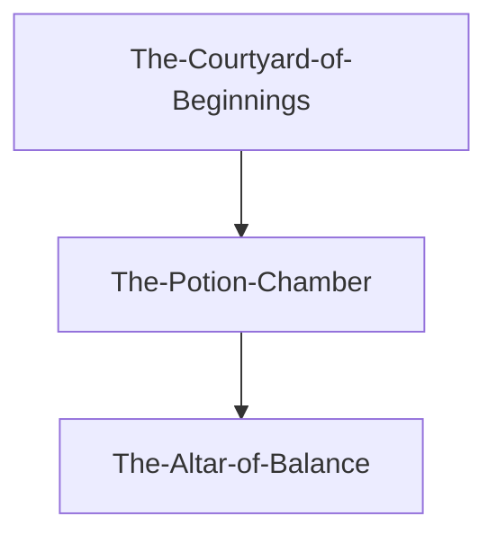
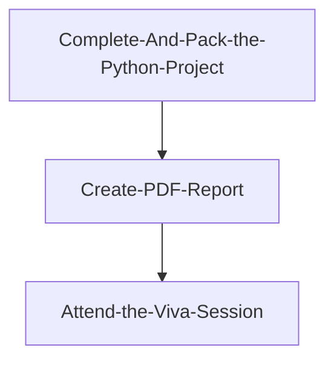

# Assignment List Down

## SE3091 - Games Technology [2025/JUL]

### 01. Assignment 02 WE

><span style="color : crimson"> **Deadline : OCT-15** _ *(Overall Marks 20%)*</span>

```
Just Analise Hogwards legacy  Game and Create a report
```

for more details read the asseement [doc](./Assignment%20Docs/GT/SE3091%20-%20Assignment%2002%20-%20GDD.pdf)

<br/>

### 02. Final Project

><span style="color : crimson"> **Deadline : Not Mentioned** _ *(Overall Marks 30%)*</span>

```markdown
# StoryLine
The player assumes the role of a wizard-in-training at Hogwarts School of
Witchcraft and Wizardry. On the first night at the castle, the student is
summoned to attempt the Wizard’s Trial, a magical test designed by the
professors to measure skill and courage.
```
<br/>



for more details read the asseement [doc](./Assignment%20Docs/GT/SE3091%20Final%20Project%202025%20.pdf)

<br/><hr/><br>

## SE3071 - Digital Image Processing

### Final Project – Domain-Specific Image Analysis and Enhancement Tool using Python & OpenCV

><span style="color : crimson"> **Deadline : Not Mentioned** _ *(Overall Marks 30%)*</span>

```markdown
# Create Education / e-Learning
Whiteboard photos, textbook scans, lecture slides
```

#### Workflow


<br/>

for more details read the asseement [doc](./Assignment%20Docs/GT/SE3071%20-%20Final%20Project%20.pdf)

<br/><hr/><br>

## SE3031 - 3D MODELING AND ANIMATION (3DMA)

### ASSIGNMENT 01 (a) : Three In-Class Weekly 3D Modeling and Texturing Activities

><span style="color : crimson"> **Deadline : OCT - 08** _ *(Overall Marks 9%)*</span>

- [x] Project: 1 - 3D skateboard modeling and texturing
- [x] Project: 2 - Donut tray
- [x] Project: 3 - Apple Watch

> Students have the freedom to select any 3D Modeling software for this assignment.

for more details read the asseement [doc](./Assignment%20Docs/3DMA/SE3031_Assignment1%20A_SLIIT%203D%20Model_2025.pdf)

<br/><br/>

### ASSIGNMENT 01 (b) (i) : Industry standards 3D asset modelling and texturing project

><span style="color : crimson"> **Deadline : OCT - 17** _ *(Overall Marks 5%)*</span>

```markdown
<AssignmentTask>
Develop a 3D asset that is ready to use in a professional 3D production.
(E.g., 3D model of a vehicle, house, furniture item(s), watch, industrial
machine, etc.) 
```

> <span style="color : tomato">**IMPORTANT :**</span> Marks will be given by evaluating the complexity of the model, realism of textures,
and industry-standard completion of the product.


> *Students have the freedom to select any 3D Modeling software for this assignment.*

for more details read the asseement [doc](./Assignment%20Docs/3DMA/SE3031_Assignment%201%20B%20i%20_SLIIT%203D%20Model_2025.pdf)

<br/><br/>

### ASSIGNMENT 01 (c)

><span style="color : crimson">Date & Time: ***19th October 2025<br/>from 9:00 AM to 11:00 AM***</span><br/>
><span style="color : green">**In Class Activity<br/>Location: G1105**</span><br/>

```markdown
<Objective>
Students will be provided with reference images of a randomly selected
object. They are required to model the object, assign appropriate
materials, and apply textures if necessary within a 2-hour timeframe.
```

<br/><br/>

### ASSIGNMENT 02 (a) : 2-Member Group Project

><span style="color : crimson">***Submission Deadline: After the final exam.***</span><br/>

```markdown
<Objective>
Students may choose any preferred software for modeling and compositing
(e.g., Autodesk Maya, Blender, Adobe After Effects, etc.). However, all
animation work must be completed using Autodesk Maya. Both group members
are required to actively participate in both modeling and animation
tasks. Evaluation will be carried out during the viva session.

```

### ASSIGNMENT 02 (b) -Viva Session

><span style="color : crimson">***After the final exam.***</span><br/>