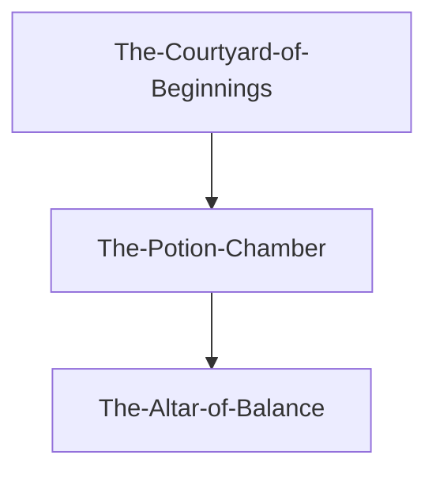

# Assignment List Down

## SE3071 - Digital Image Processing [2025/JUL]

### 01. Assignment 02 WE

><span style="color : crimson"> **Deadline : OCT-15** _ *(Overall Marks 20%)*</span>

```
Just Analise Hogwards legacy  Game and Create a report
```

for more details read the asseement [doc](./Assignment%20Docs/GT/SE3091%20-%20Assignment%2002%20-%20GDD.pdf)

<br/>

### 02. Final Project

><span style="color : crimson"> **Deadline : Not Mentioned** _ *(Overall Marks 30%)*</span>

```markdown
# StoryLine
The player assumes the role of a wizard-in-training at Hogwarts School of
Witchcraft and Wizardry. On the first night at the castle, the student is
summoned to attempt the Wizard’s Trial, a magical test designed by the
professors to measure skill and courage.
```
<br/>



for more details read the asseement [doc](./Assignment%20Docs/GT/SE3091%20Final%20Project%202025%20.pdf)